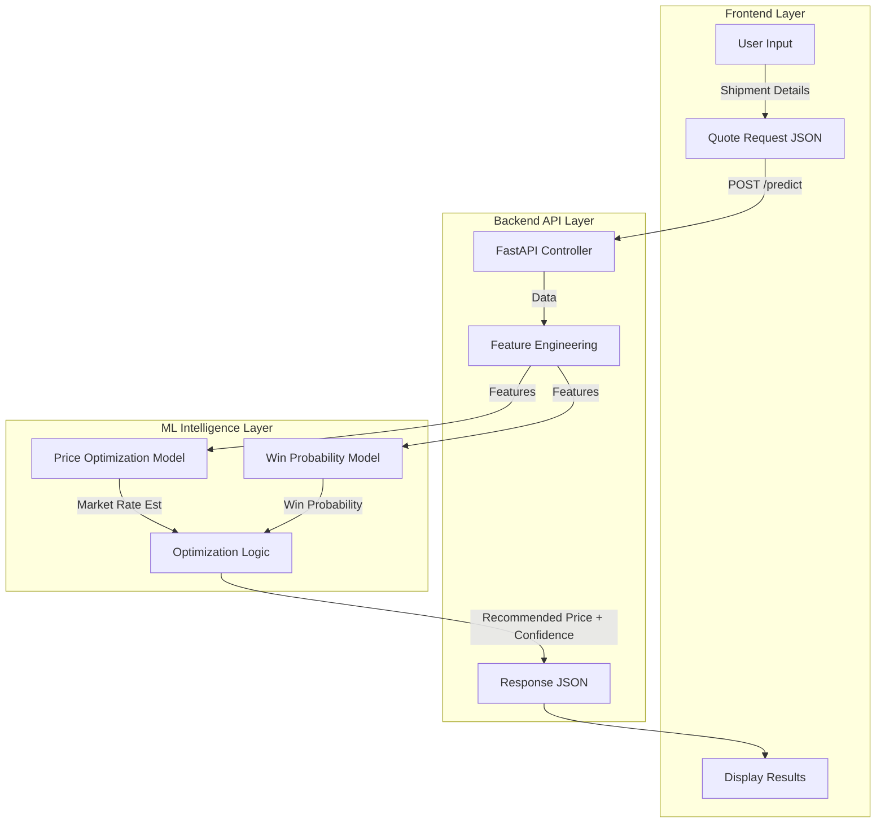
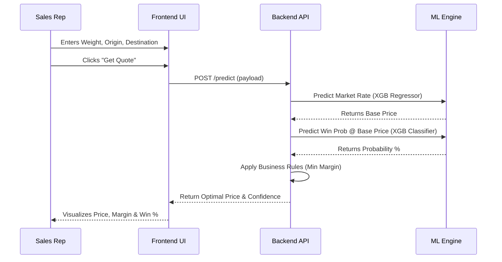

# Quote Genie: Predictive Pricing Intelligence Engine (PPIE)

**Quote Genie** eliminates manual, inconsistent quoting by leveraging supervised machine learning to forecast optimal prices in real-time. It balances win probability with target margins, transforming pricing into an adaptive, AI-driven process.

## 🚀 Key Features
- **Dual-Model Strategy**: 
    - **Win Probability Model** (XGBoost Classifier) predicts acceptance likelihood.
    - **Price Optimization Model** (XGBRegressor) forecasts market rates.
- **Real-Time Quoting**: Instant price recommendations via FastAPI backend.
- **Rich Aesthetics**: Modern, glassmorphism-based UI for sales reps.
- **Explainability**: Insights into key factors driving the price (Weight, Market Conditions).

## 🛠️ Architecture
- **Frontend**: React + Vite (Glassmorphism Design)
- **Backend**: FastAPI (Python)
- **ML Engine**: Scikit-Learn, XGBoost, Pandas
- **Data**: Synthetic Data Generator included for demonstration.

## 🏁 Getting Started

### 1. Backend Setup
The backend handles the ML inference and API requests.

```bash
cd backend
# Install dependencies
pip install -r requirements.txt
pip install scikit-learn xgboost pandas numpy joblib fastapi uvicorn python-multipart

# Start the API server
uvicorn main:app --reload
```
The API will be available at `http://localhost:8000`.

### 2. Machine Learning Engine
To train the models from scratch (using synthetic data):

```bash
cd ml_engine
# Generate synthetic historical data
python generate_data.py

# Train models (Win Probability & Price Optimization)
python train_model.py
```
This will save trained models to `backend/models/`.

### 3. Frontend Setup
The frontend provides the sales rep interface.

```bash
cd frontend
# Install dependencies
npm install

# Start the development server
npm run dev
```
Open your browser at the URL shown (usually `http://localhost:5173`).

## 📂 Project Structure
```
Quote_Genie/
├── backend/            # FastAPI Application
│   ├── main.py         # API Endpoints & Inference Logic
│   ├── models/         # Trained ML Models (pkl files)
│   └── requirements.txt
├── frontend/           # React + Vite Application
│   ├── src/components/ # UI Components (QuoteForm)
│   └── src/api/        # API Integration
├── ml_engine/          # Machine Learning Scripts
│   ├── generate_data.py # Synthetic Data Generator
│   └── train_model.py   # Model Training Pipeline
└── docs/               # Documentation
```

## 📊 How It Works

The Quote Genie engine operates in a four-stage pipeline:

1.  **Input**: Sales rep enters shipment details (Weight, Volume, Route, Customer Segment).
2.  **Predict**:
    *   **Price Optimization Model**: Estimates the current market rate for the lane.
    *   **Win Probability Model**: Predicts the likelihood of the customer accepting a quote at various price points.
3.  **Optimize**: The system identifies the price point that maximizes expected margin while maintaining a safe win probability threshold.
4.  **Display**: The frontend presents the "Recommended Price", a confidence interval, and key influencing factors (SHAP values).

### 🔄 End-to-End System Flow



### 🧠 App Workflow



